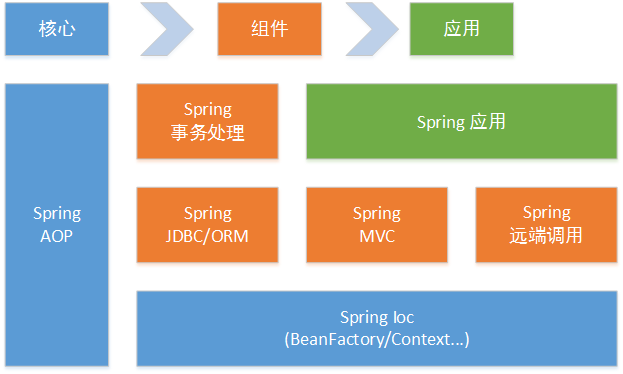

# Spring 架构

​	作为Java领域最为成功的开源软件之一，Spring在Java EE开发中使用众多，现已发展成为包含软件构建、开发、运行、部署整个软件生命周期的产品族群。总体来讲，Spring有如下特性：

+ 非侵入性轻量级框架，应用代码可以在没有Spring或者其他容器的情况下运行。

+ POJO编程模型，简化开发、测试和部署流程。

+ 面向对象、面向接口编程，提高代码可重用性和可测试性。

+ 完善的平台和丰富的应用模块，用户可以任意裁剪组合使用。

  为了理清这个族群，我们将Spring按照核心层、组件层和应用层分解成如下架构：

+ **核心层**（AOP & IoC）：提供IoC容器的支持和面向切面编程的框架。IoC容器使得传统的对象-对象的关系解耦为对象-IoC容器-对象的关系，通过一个IoC容器的配置文件就可以详细阐述所有对象的依赖关系，灵活性更强；AOP集成了AspectJ最为AOP的一个特定实现，同时还在JVM动态代理和CGLIB的基础上，实现了AOP框架。这两个模块是Spring的核心，提供了公共的编程接口，这些编程接口一方面可以被Spring的其他模块使用并进行二次开发，另一方面也直接提供给用户使用。
+ **组件层**（JDBC/MVC..）：就像操作系统一样，构建了核心层如果不提供驱动程序，对用户来说就没有太大的应用价值，Spring围绕核心层构建了许多开箱机用的组件，包括前端框架使用Spring MVC，后端操作数据库的Spring JDBC、Spring 事务处理等，用户可以组合使用这些组件来搭建一套完整的开发框架。
+ 应用层（Security/Data..）：严格来说，这个模块不属于Spring范围。这部分的应用支持往往来自一些使用非常广泛的Spring子项目，或者该项目本身就可以看做是一个独立的Spring应用。这些应用丰富了Spring的生态圈，使Spring使用越来越广泛。

​        

​	既然Spring的模块如此之多，我们常用到的有哪些呢？我们常用的Spring组件是在Spring-framework项目里。这个项目又有如下几类构件（这里所说的构件是从Maven的角度来讲的），在接下来的章节里，我们将重点讲解这些构件的设计理念和源码实现。

