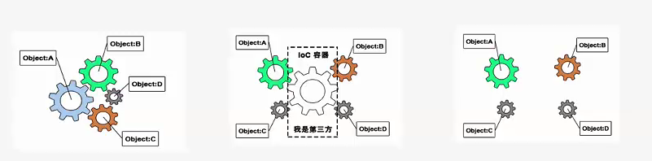
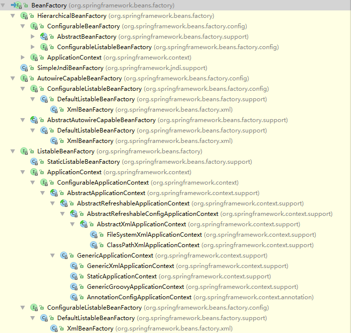
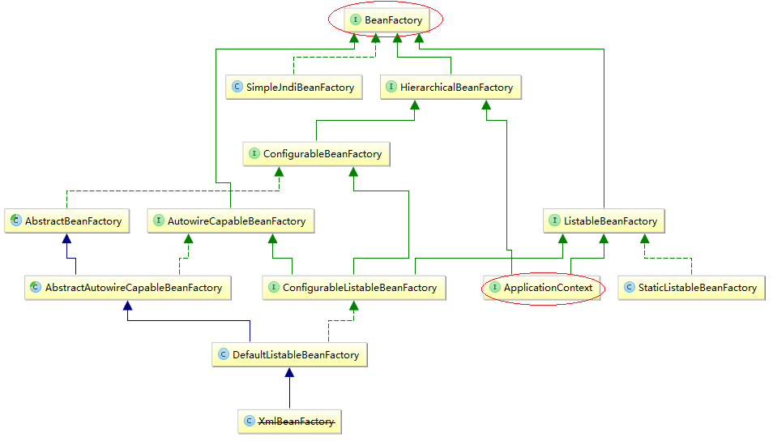
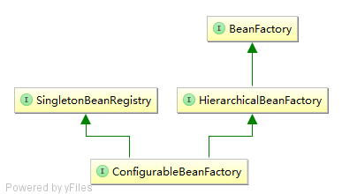
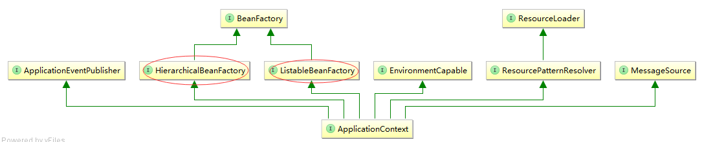
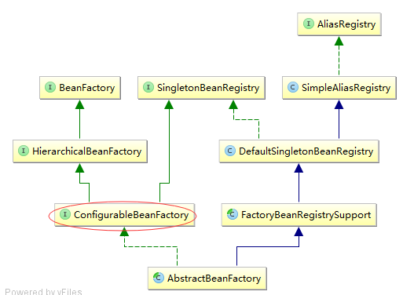
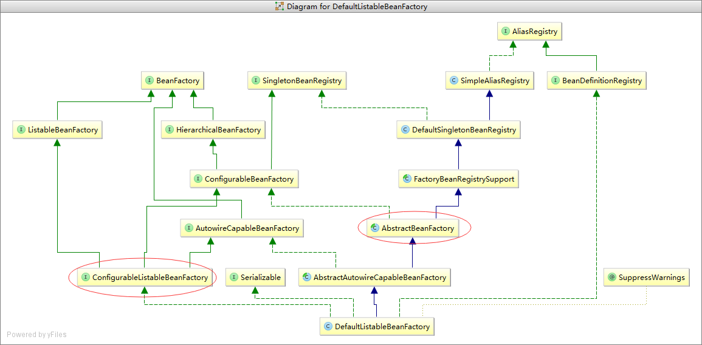
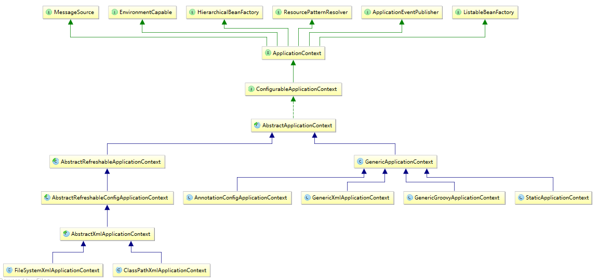
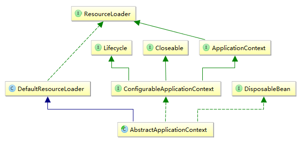

# Spring IoC的设计

> 在本章节，重点讲解Spring IoC的设计思想。

## 依赖倒置（Dependence Inversion）、控制反转（Inversion of Control）、依赖注入（Dependency Injection）

> 读者可能会被“依赖倒置”、“控制反转“、"依赖注入"这么多概念所混淆，其实讲的都是同类的事情。如果非要区分的话，依赖倒置（也成为控制反转）是原则（或者说是设计思想），依赖注入是实现方式，通过注入的方式实现了依赖倒置原则。

​	**解耦和最重要的原则就是依赖倒置原则：高层模块不应该依赖底层模块，他们都应该依赖抽象。抽象不应该依赖于细节，细节应该依赖于抽象。** 试想如果合作对象的引用或依赖关系的管理有具体的对象来完成，会导致代码的高度耦合和测试性降低，这对复杂的面向对象系统的设计是非常不利的，而把控制权从具体业务对象手中转交到平台或者框架中，是降低面向对象系统设计复杂性和提高面向对象系统可测试性的一个有效解决方案。

​	如下图左所示，在没有引入IoC容器之前，各个对象是直接耦合在一起的，这样高度耦合的关系对测试和重构都不友好；在引入IoC容器之后，如下图中所示，使用容器来管理各个对象之间的依赖，大大降低了对象之间的耦合性；同时发现去掉这些IoC容器，如下图右所示，这些对象仍然可以独立的进行开发；可见引入IoC容器之后不仅方便了对象之间的关联管理，也使得对象都可以独立的进行开发和测试。



​	在Spring中，通过使用IoC容器，对象依赖关系的管理被反转了，转到IoC容器中来了，对象之间的相互依赖关系有IoC容器进行管理，并由IoC容器完成对象的注入。在具体的注入实现中，接口注入、setter注入和构造器注入都是主要的注入方式。在Spring的IoC设计中，setter注入和构造器注入是主要的注入方式。

注：更多关于依赖倒置原理，请参考：[Spring的IOC原理](http://www.importnew.com/14751.html)

> 在了解控制反转之后，下面我们将重点讲解Spring是如何实现控制反转容器的。

## IoC框架设计分析

​	Spring 提供了两个主要的容器系列，一个是实现了**BeanFactory**接口的简单容器系列，这个系列的容器实现了容器最为基本的功能，另一个是**ApplicationContext**，最为高级容器，他在BeanFactory基础上增加了许多面向框架的特性，同时对应用环境做了许多适配。下面我们就开始分析Spring IoC容器。

如下所示，是Spring IoC容器完整的类继承关系图，



​	**接口-抽象类-具体类**是Java编程的三剑客。接口用来定义规范，表述当前这个接口能够提供哪些服务；抽象类是实现了一个或多个接口的部分服务的模板类，有了这些模板类可以把一些公共的方法提取出来并实现，方便用户直接基于模板类进行具体类的设计与实现；而具体类就是针对某种场景的具体实现方式，一般同一个服务针对不同的场景可能有不同的实现方式，这些不同实现方式是通过具体类来具体实施的。同理，Spring IoC容器也遵循这个规范，我们设计了一个基类接口BeanFactory，它定义了一个IoC容器所需的最基本的功能；然后又在该基本功能的基础上继续添加新的功能，以适应不同的场景。

​	如前所述，Spring 提供了两类容器：BeanFactory和ApplicationContext。下面我们将分别对这两类容器按层次进行讲解。

> ​	在下面的分层讲解中，我们的重心不是讲解每个类或接口的具体细节，而是理清楚整个Spring IoC框架的架构，从而深入理解Spring的设计思想。

### BeanFactory 主线

如下所示，是BeanFactory的设计图。



> ​ 	:anchor: 需要注意的是，这个类图不是完整的，省略了很多无关的接口，如ApplicationContext接口还扩展了诸如MessageSource等接口，在该图中被省略，我们只关心核心的容器相关的接口，对于其他的细节不做过多讨论。下面出现的类图同理。

#### 0层：BeanFactory

​	BeanFactory是Spring IoC容器的基本接口。不看源码前，我们先试想一个容器最基本的功能是什么？应该是能够**存取对象**！用户能够将特定类型的对象放入容器中以便其它对象直接从容器中取用。这是作为容器最基本的特性。BeanFactory就是为此而设计的。它包含了4种获取Bean的方法；5中检测Bean的方法和一种获取Bean别名的方法。这些方法是作为容器的最基本的特征，用户可以从这个容器中取出自己想要的特定类型的Bean，也可以去检测这个Bean是否符合某个特征。

> ​	:anchor: 细心的读者会发现这些都是取对象的方法，怎么没有存对象的方法呢？确实只有先存入对象，后面才能够取对象。在Spring中，关于对象如何存入的，是在Resource和ResourceLoader接口中定义的。这里将容器的“存”和“取”的过程分开，使得容器的设计更加模块化。对于使用者来说，可能根本不关心对象时如何存入容器的，他们只需要知道能够从容器中使用即可。这也遵循Spring的"to the developers, for the developers, and by the developers"的思想。[模块化思想]

```java
public interface BeanFactory {

	String FACTORY_BEAN_PREFIX = "&";
 //获取Bean
	Object getBean(String name) throws BeansException;
	<T> T getBean(String name, Class<T> requiredType) throws BeansException;
	<T> T getBean(Class<T> requiredType) throws BeansException;
	Object getBean(String name, Object... args) throws BeansException;
//检测Bean
	boolean containsBean(String name);
	boolean isSingleton(String name) throws NoSuchBeanDefinitionException;
	boolean isPrototype(String name) throws NoSuchBeanDefinitionException;
	boolean isTypeMatch(String name, Class<?> targetType) throws NoSuchBeanDefinitionException;
	Class<?> getType(String name) throws NoSuchBeanDefinitionException;
//其它信息
	String[] getAliases(String name);

}
```

#### 1层：HierarchicalBeanFactory、AutowireCapableBeanFactory、ListableBeanFactory

​	这三个接口是直接扩展了BeanFactory接口，并且在该接口上扩展了一些新的特性。

（1）HierarchicalBeanFactory

​	这个接口的目的是使得容器具有了层次关系，即任何一个容器还可能有父容器。其接口功能如下：

> ​	这种特性对于实际的软件项目来说是合理的。我们以Maven的POM文件为例，Maven自带了一个超级POM，这个POM定义了一些最基本的诸如中央仓库和插件的位置等信息，用户自定义的POM都是这个超级POM的子POM，甚至用户还可以自己定义这样继承关系的POM，通过这样层次化的POM管理，使得POM使用起来更加方便。[层次化思想]

```java
public interface HierarchicalBeanFactory extends BeanFactory {
  //获取父容器
	BeanFactory getParentBeanFactory();
  //检测本地容器是否包含该Bean
	boolean containsLocalBean(String name);
}
```

（2）AutowireCapableBeanFactory（==TODO==）

​	这个接口使得容器具备了自动装配的能力。

（3）ListableBeanFactory

​	BeanFactory所提供的获取Bean的方法太过简单，这个接口增加了许多新的功能。如对`BeanDefinition`的查询功能、查询某个类型或某个注解下的所有Bean名字等。

```java
public interface ListableBeanFactory extends BeanFactory {

	boolean containsBeanDefinition(String beanName);
	int getBeanDefinitionCount();
	String[] getBeanDefinitionNames();

	String[] getBeanNamesForType(Class<?> type);
	String[] getBeanNamesForType(Class<?> type, boolean includeNonSingletons, boolean allowEagerInit);

	<T> Map<String, T> getBeansOfType(Class<T> type) throws BeansException;
	<T> Map<String, T> getBeansOfType(Class<T> type, boolean includeNonSingletons, boolean allowEagerInit)
			throws BeansException;

	String[] getBeanNamesForAnnotation(Class<? extends Annotation> annotationType);
	Map<String, Object> getBeansWithAnnotation(Class<? extends Annotation> annotationType) throws BeansException;
	<A extends Annotation> A findAnnotationOnBean(String beanName, Class<A> annotationType)
			throws NoSuchBeanDefinitionException;

}
```

#### 2层：ConfigurableBeanFactory、ApplicationContext

​	如果说在第一层的接口设计中，已经添加了很多新的特性，极大的丰富了接口所能提供的能力，那么在第二层的接口设计中，更多的是组合这些接口的特性，以为实现一个完整可用的容器做铺垫。下面我们将重点介绍ConfigurableBeanFactory和ApplicationContext这两个接口的设计图。

（1）ConfigurableBeanFactory

​	ConfigurableBeanFactory接口扩展了HierarchicalBeanFactory和SingletonBeanRegistry，使得它具备了层级容器的特质（HierarchicalBeanFactory），而且具有Bean注册的能力（SingletonBeanRegistry）。从名字上来看，就可以知道这个接口主要是用来定义如何配置容器的，如设置容器的加载Bean的类加载器、Bean的Scope、Bean的metadata缓存等等。它的类图和接口功能如下所示：



```java
public interface ConfigurableBeanFactory extends HierarchicalBeanFactory, SingletonBeanRegistry {
//scope
   String SCOPE_SINGLETON = "singleton";
   String SCOPE_PROTOTYPE = "prototype";
// parent BeanFactory
   void setParentBeanFactory(BeanFactory parentBeanFactory) throws IllegalStateException;
//class loader
   void setBeanClassLoader(ClassLoader beanClassLoader);
   ClassLoader getBeanClassLoader();
   void setTempClassLoader(ClassLoader tempClassLoader);
   ClassLoader getTempClassLoader();
//metadata
   void setCacheBeanMetadata(boolean cacheBeanMetadata);
   boolean isCacheBeanMetadata();
//BeanExpressionResolver
   void setBeanExpressionResolver(BeanExpressionResolver resolver);
   BeanExpressionResolver getBeanExpressionResolver();
//ConversionService
   void setConversionService(ConversionService conversionService);
   ConversionService getConversionService();
//PropertyEditor
   void addPropertyEditorRegistrar(PropertyEditorRegistrar registrar);
   void registerCustomEditor(Class<?> requiredType, Class<? extends PropertyEditor> propertyEditorClass);
   void copyRegisteredEditorsTo(PropertyEditorRegistry registry);
//TypeConverter
   void setTypeConverter(TypeConverter typeConverter);
   TypeConverter getTypeConverter();
//ValueResolver
   void addEmbeddedValueResolver(StringValueResolver valueResolver);
   String resolveEmbeddedValue(String value);
//BeanPostProcessor
   void addBeanPostProcessor(BeanPostProcessor beanPostProcessor);
   int getBeanPostProcessorCount();
//scope
   void registerScope(String scopeName, Scope scope);
   String[] getRegisteredScopeNames();
   Scope getRegisteredScope(String scopeName);
//AccessControlContext
   AccessControlContext getAccessControlContext();
//configure copy
   void copyConfigurationFrom(ConfigurableBeanFactory otherFactory);
//Alias
   void registerAlias(String beanName, String alias) throws BeanDefinitionStoreException;
   void resolveAliases(StringValueResolver valueResolver);
//merge BeanDefinition
   BeanDefinition getMergedBeanDefinition(String beanName) throws NoSuchBeanDefinitionException;
// FactoryBean test
   boolean isFactoryBean(String name) throws NoSuchBeanDefinitionException;
//CurrentlyInCreation
   void setCurrentlyInCreation(String beanName, boolean inCreation);
   boolean isCurrentlyInCreation(String beanName);
//DependentBean
   void registerDependentBean(String beanName, String dependentBeanName);
   String[] getDependentBeans(String beanName);
   String[] getDependenciesForBean(String beanName);
//destroy bean
   void destroyBean(String beanName, Object beanInstance);
   void destroyScopedBean(String beanName);
   void destroySingletons();

}
```

（2）ApplicationContext

​	作为高级形态的容器ApplicationContext，它不仅扩展基本容器的功能：HierarchicalBeanFactory和ListableBeanFactory，还在此基础上又扩展了其他诸如MessageSource、ResourceLoader等接口，使得该容器的功能更加丰富。更多关于ApplicationContext容器，我们将在[ApplicationContext主线](#ApplicationContext主线)章节进行详细讲解，在这里只是阐述ApplicationContext在整个容器接口体系中的位置。



#### 3层：AbstractBeanFactory

​	前面讲了三层都是接口的设计，现在终于有一个半成品：AbstractBeanFactory抽象类了。这个抽象类的类图如下所示：



​	作为抽象类，它是具体类的模板类，本身已经实现了ConfigurableBeanFactory及其父接口的大部分方法，而且也定义了许多默认的属性值。如在抽象类AbstractBeanFactory中，实现了BeanFactory接口的`getBean(...)`方法（可以说这个方法是容器的最为核心的方法）、`containsBean(...)`方法等，HierarchicalBeanFactory接口的`getParentBeanFactory()`方法和`containsLocalBean()`方法；以及ConfigurableBeanFactory接口的`setBeanClassLoader(...)`、`setCacheBeanMetadata(...)`、`addBeanPostProcessor(...)`等方法；而关于`BeanDefinition`的`containsBeanDefinition(...)`、`getBeanDefinition()`方法和真正创建Bean的`createBean(...)`方法都没有实现，交由子类来具体实现。

#### 4层：DefaultListableBeanFactory

​	DefaultListableBeanFactory是目前为止第一个成型可用的容器。它的类图如下所示。



​	在第三层AbstractBeanFactory讲解中，我们说到有关于`containsBeanDefinition(...)`、`getBeanDefinition()`和`createBean(...)`这三个方法都没有实现，那是不是交由作为成品的DefaultListableBeanFactory来实现的呢？其实Spring并没有这样做，而是交由AbstractBeanFactory的抽象子类AbstractAutowireCapableBeanFactory实现这三个方法。读者看源码可以发现这个抽象类已经实现了一个容器所需的所有核心方法--**存取对象**的所有相关方法都已经实现。那为什么不直接把AbstractAutowireCapableBeanFactory定义为具体类作为一个产品呢？回答这个问题就需要深入分析AbstractBeanFactory、AbstractAutowireCapableBeanFactory和DefaultListableBeanFactory这三个类具体实现了哪些方法。下面我们看看这三个类的方法表：


> 注：该图是矢量图，可放大观察。

通过对比这三个类的方法表，可以发现：

（1）AbstractBeanFactory的方法最多而且最为基本，即从容器中**“取”**对象的相关方法（如BeanFactory基本容器接口的`getBean(...)`、`isSingleton(...)`、`isTypeMatch(...)`方法）都由该抽象类实现；

（2）AbstractAutowireCapableBeanFactory的方法大多是**“存”**对象的相关方法（如AutowireCapableBeanFactory的`autowireBean(...)`、`createBean(...)`、`destroyBean(...)`方法）都由该抽象类实现；

（3）更多关于Bean的细节处理，交由具体类DefaultListableBeanFactory来完成，如BeanDefinition相关的方法（包括`getBeanDefinition(...)`和`registerBeanDefinition(...)`等）、解析依赖相关的方法（包括`getDependencyComparator()`、`resolveDependency(...)`等），都是由具体的实现类来完成。

> ​	在本小节中，我们分4层讲述了BeanFactory接口的设计思想，我们没有深究方法细节，而是从架构角度观察接口->抽象类->具体类这样的分层设计的思想。而更多关于实现的细节，我们将在Spring IoC实现章节讲解。

### ApplicationContext 主线

ApplicationContext的设计图如下所示：



​	在BeanFactory主线分析中，我们已经详细分析了BeanFactory各个接口、抽象类和具体类的设计理念。ApplicationContext的设计理念和BeanFactory是相似的，准确的说应该是更简单。在这条主线中，没有BeanFactory主线中各种纷杂的接口（如提供装配功能的AutowireCapableBeanFactory接口、提供层次容器功能的HierarchicalBeanFactory接口、提供更多Bean相关信息的ListableBeanFactory接口等），在ApplicationContext中只有一个接口：ApplicationContext！当然也只有一个直接相关的抽象类：AbstractApplicationContext！和BeanFactory主线分析方法相同，我们将分层分析ApplicationContext的设计。

####  0层：ApplicationContext

​	通过阅读源码我们发现ApplicationContext接口方法不多，如下所示：

```java
	String getId();
	String getApplicationName();
	String getDisplayName();
	long getStartupDate();
	ApplicationContext getParent();
	AutowireCapableBeanFactory getAutowireCapableBeanFactory() throws IllegalStateException;
```

​	只有短短的6个方法，这些方法中5个都是跟Application（以下翻译为应用）相关的：标识Application的ID、名字和展示的名字、父Context、启动时间，还有一个是可以获取容器的方法：`getAutowireCapableBeanFactory()`。读者需要注意的是，ApplicationContext接口并不是一个孤立的接口，它本身也是在其它接口的基础上进行了扩展，接口图如下所示：


由此可见，ApplicationContext并不简单！官方给的定义是：

> ​	ApplicationContext 接口是用来提供应用配置的核心接口。这些配置在应用的运行期间是只读的，当然你也可以实现成支持重新载入配置的类。一个ApplicationContext 能够提供如下功能：
>
> + 提供IoC容器允许用户取应用的组件，这个功能来自ListableBeanFactory接口；
> + 以更加通用的方式来载入资源文件，这个功能来自ResourceLoader接口；
> + 将事件发布给已经注册的监听器，这个功能来自ApplicationEventPublisher接口；
> + 解析消息的能力以便实现国际化，这个功能来自MessageSource接口；
> + 能够继承父类context，子类context定义的配置将会优先父类context的配置。

#### 1层：ConfigurableApplicationContext

​	ConfigurableApplicationContext的作用，类似于ConfigurableBeanFactory，用于配置ApplicationContext。ApplicationContext其实只是提供了一些**取**的方法，那么如何**存**呢？这些都是在ConfigurableApplicationContext接口中定义的，除此以外，还有一些Environment、BeanFactoryPostProcessor、ApplicationListener等信息也是通过ConfigurableApplicationContext来进行配置的。如下所示：

```java
	String CONFIG_LOCATION_DELIMITERS = ",; \t\n";
	String CONVERSION_SERVICE_BEAN_NAME = "conversionService";
	String LOAD_TIME_WEAVER_BEAN_NAME = "loadTimeWeaver";
	String ENVIRONMENT_BEAN_NAME = "environment";
	String SYSTEM_PROPERTIES_BEAN_NAME = "systemProperties";
	String SYSTEM_ENVIRONMENT_BEAN_NAME = "systemEnvironment";

	void setId(String id);
	void setParent(ApplicationContext parent);
	ConfigurableEnvironment getEnvironment();
	void setEnvironment(ConfigurableEnvironment environment);
	void addBeanFactoryPostProcessor(BeanFactoryPostProcessor beanFactoryPostProcessor);
	void addApplicationListener(ApplicationListener<?> listener);
	void refresh() throws BeansException, IllegalStateException;
	void registerShutdownHook();
	void close();
	boolean isActive();
	ConfigurableListableBeanFactory getBeanFactory() throws IllegalStateException;
```

#### 2层：AbstractApplicationContext

​	作为ApplicationContext的抽象类实现，其类图如下所示。类似于AbstractBeanFactory，这个抽象类也是实现了一个基本的ApplicationContext的功能。作为最为核心的IoC容器功能，AbstractApplicationContext是如何实现的呢？这是我们重点关心的问题。



​	如果AbstractApplicationContext将容器的功能全部独立的重新实现一遍，这样和AbstractBeanFactory的大部分代码将会产生重复，显然不划算，AbstractApplicationContext实际上是将容器相关的功能代理给了一个`ConfigurableListableBeanFactory`接口，交由该接口来实现容器的所有方法。详细解释如下：

作为最为容器最为核心的`getBean(...)`方法，AbstractApplicationContext的实现如下：

```java
	public Object getBean(String name) throws BeansException {
		assertBeanFactoryActive();//检测容器是否已经被激活。
		return getBeanFactory().getBean(name);
	}
```

我们发现它是将`getBean(...)`方法代理给了`getBeanFactory()`返回来的对象的`getBean(...)`方法。那么`getBeanFactory()`将返回什么呢？以下是它的源码：

```java
public abstract ConfigurableListableBeanFactory getBeanFactory() throws IllegalStateException;
```

​	由此可见AbstractApplicationContext是将其作为抽象方法，交由子类去实现，但目的是返回一个ConfigurableListableBeanFactory的对象，后面所有容器相关的方法都会直接代理到这个对象上，从而复用了容器相关的代码。

#### 3层及以后：AbstractXXXApplicationContext、XXXApplicationContext

​	后续的都是一些抽象类（如AbstractRefreshableApplicationContext、AbstractRefreshableConfigApplicationContext、AbstractXmlApplicationContext 等）和具体类（FileSystemXmlApplicationContext、ClassPathXmlApplicationContext、GenericApplicationContext等）。这些类的设计图如下所示，更多的关于细节分析，将在后续的Spring IoC实现讲解。


## IoC框架设计总结

​	我们以BeanFactory和ApplicationContext这两条主线，分析了Spring IoC的设计框架。通过上述的分析发现，Spring IoC深入贯彻了JAVA的**接口-抽象类-具体类**三剑客的使用原则：用接口来定义服务规范，基本接口只提供一项服务（如BeanFactory的取检对象功能、HierarchicalBeanFactory的层次容器功能等），通过组合这些接口来提供更加丰富的服务（如ApplicationContext接口扩展了若干个接口，是一个功能丰富的容器）；用抽象类来提供基本公共服务的实现，作为子类的实现模板（如AbstractBeanFactory接口和AbstractApplicationContext都实现了BeanFactory接口核心的`getBean()`方法等，这些方法在具体类中不需要再重复实现一遍，而具体类只需要关注特定的场景，进行更加细节的配置即可）；用具体类来完善具体服务的使用场景（如FileSystemXmlApplicationContexth和ClassPathXmlApplicationContext就是ApplicationContext在两个不同场景下的具体实现类）。